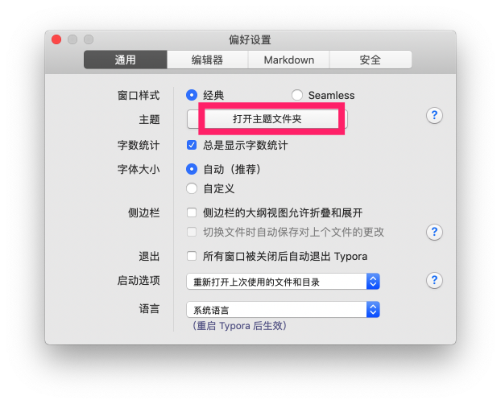
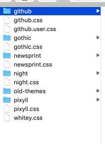
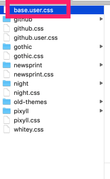

# Typora 主题自动编号

## 特性

- [x] 内容标题自动编号
- [x] TOC 自动编号
- [x] 侧边栏目录导航自动编号

## 效果预览

配置前：

配置后：

## 配置说明

1. 打开 typora 的主题目录

2. 将仓库中的 `base.user.css` 和 `github.user.css` 两个文件都拷贝到主题目录中

3. 配置完成，重启 typora 文档内容标题就会有自动编号了。

## 参考链接

- https://support.typora.io/Add-Custom-CSS/
- https://support.typora.io/Auto-Numbering/
